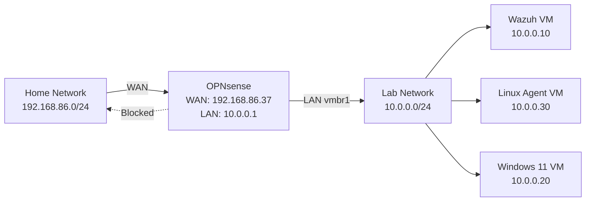
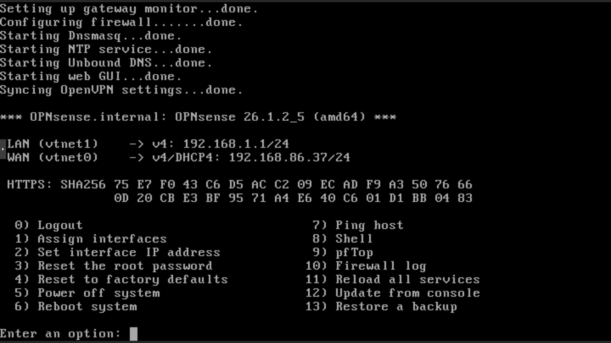
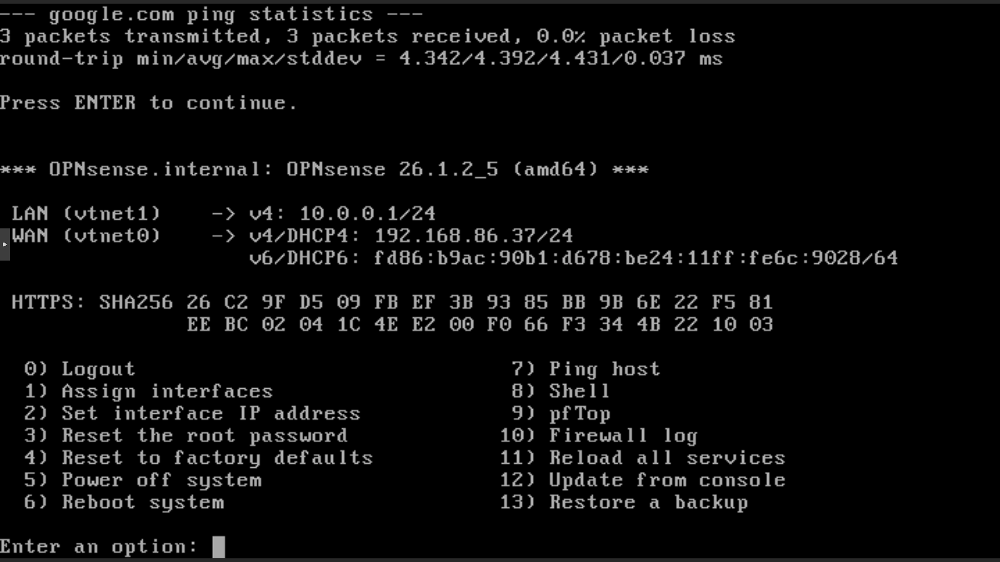
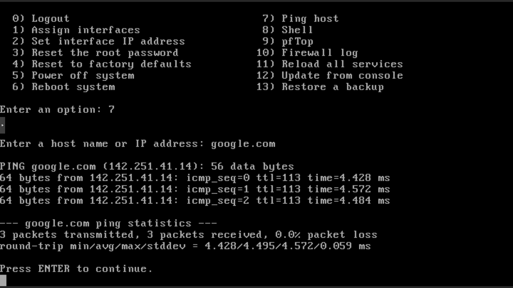
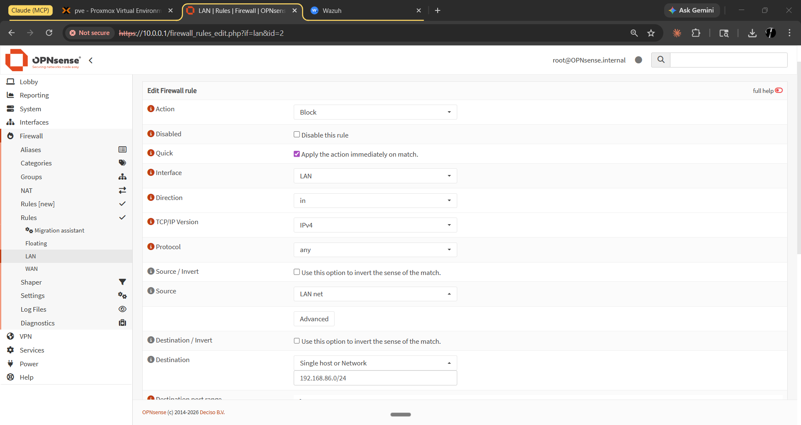
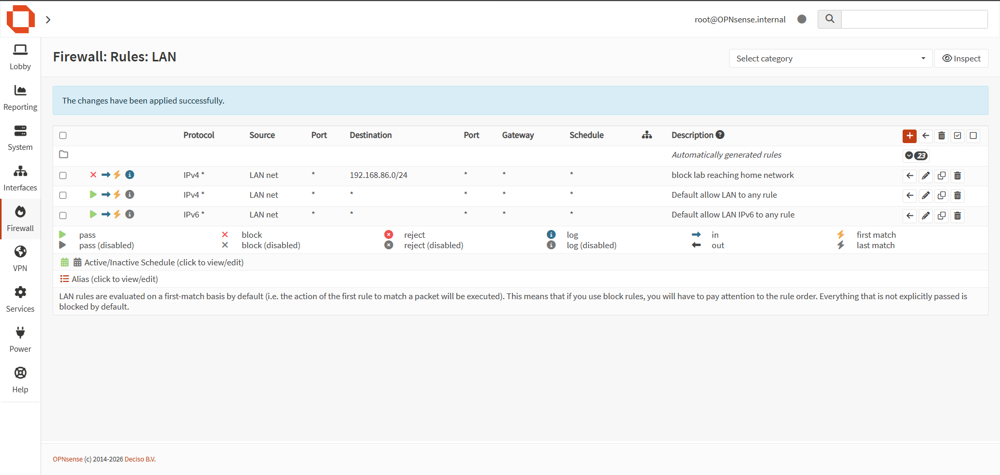

# OPNsense Firewall Lab

Network segmentation firewall isolating a 10.0.0.0/24 lab network from the home network, built on Proxmox VE.

---

## Architecture

---

## What this is

I run a security homelab on a Proxmox hypervisor. The lab network needs to be isolated from my home network — lab VMs can reach the internet, but they cannot reach my home router, other devices, or anything on 192.168.86.0/24.

OPNsense sits between those two networks. It handles NAT for internet access and enforces the block rule that keeps lab traffic from bleeding into the home network.

---

## Lab environment

| Component | Details |
|---|---|
| Hypervisor | Proxmox VE on AMD Ryzen 5 5500U, 16GB RAM |
| WAN bridge | vmbr0 — connected to home network (192.168.86.0/24) |
| LAN bridge | vmbr1 — isolated lab network (10.0.0.0/24) |
| OPNsense WAN IP | 192.168.86.37 |
| OPNsense LAN IP | 10.0.0.1/24 (gateway for all lab VMs) |

---

## What I built

### 1. Initial OPNsense setup

Deployed OPNsense as a VM on Proxmox with two virtual NICs — one on vmbr0 (WAN) and one on vmbr1 (LAN). By default, OPNsense came up with a LAN IP of 192.168.1.1, which conflicts with the home network range. I reconfigured the LAN to 10.0.0.1/24 and verified WAN connectivity before touching anything else.

### 2. Network segmentation

Two separate Proxmox bridge interfaces keep the networks isolated at the hypervisor level:
- vmbr0: bridged to the physical NIC connected to my home router
- vmbr1: internal-only bridge, no physical NIC attached

All lab VMs get their NICs on vmbr1 only. They reach the internet through OPNsense NAT, not directly.

### 3. Firewall rule — block lab-to-home

OPNsense processes rules top-down, first match wins. The default LAN rule allows everything from LAN to anywhere. If I leave that as the only rule, lab VMs can reach the home network freely. The fix is an explicit block rule above it: drop any traffic from 10.0.0.0/24 destined for 192.168.86.0/24, and let the default allow handle everything else.

**Rule order (LAN interface):**

| Priority | Action | Source | Destination | Purpose |
|---|---|---|---|---|
| 1 | Block | 10.0.0.0/24 | 192.168.86.0/24 | Prevent lab → home |
| 2 | Allow | 10.0.0.0/24 | any | Normal internet access |

---

## Screenshots

### 1. Initial boot — default LAN 192.168.1.1

OPNsense first boot with the default LAN of 192.168.1.1. That address would conflict with the home network, so I reconfigured it immediately before doing anything else.

---

### 2. LAN reconfigured to 10.0.0.1, WAN connectivity verified

LAN changed to 10.0.0.1/24, WAN confirmed reachable. No point building firewall rules on a misconfigured interface.

---

### 3. WAN ping to google.com — 0% packet loss

Ran a ping from the OPNsense diagnostics page before installing anything. Zero packet loss confirms WAN is up and NAT is working.

---

### 4. Block rule configuration

The block rule with 192.168.86.0/24 as the destination. I used Block, not Reject. Block drops silently; Reject sends ICMP back. Dropping silently is better here — nothing on the lab should be probing the home network anyway, and there's no reason to confirm the network exists.

---

### 5. Block rule applied and active on LAN interface

Final LAN ruleset. Block rule is at the top, default allow below it. OPNsense hits the block first for any traffic toward 192.168.86.0/24.

---

## Security decisions

**Block vs. Reject:** Block drops silently. Reject sends ICMP unreachable back to the source. I used Block because there's no legitimate reason for anything in the lab to talk to the home network, and responding with an ICMP message just confirms the network boundary exists. Dropping silently is the right call.

**Rule ordering:** The default LAN rule allows all traffic from LAN to anywhere. That rule has to exist so the VMs can reach the internet. The block rule for 192.168.86.0/24 only works if it sits above the default allow — OPNsense stops at the first match. I verified the order in the ruleset screenshot before testing.

**Two bridges instead of VLANs:** Separate Proxmox bridges give hypervisor-level isolation without 802.1Q tagging. It's simpler for a single-node lab and harder to misconfigure. The tradeoff is it uses two host interfaces instead of one trunked interface, but that's fine at this scale.

---

## Skills demonstrated

- Network segmentation and lab isolation
- Firewall rule ordering (stateful, top-down evaluation)
- NAT configuration for internet access from an isolated network
- Defense-in-depth using two independent controls (block rule + bridge isolation)
- Proxmox networking (bridge interfaces, VM NIC assignment)
